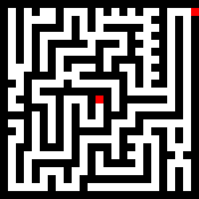
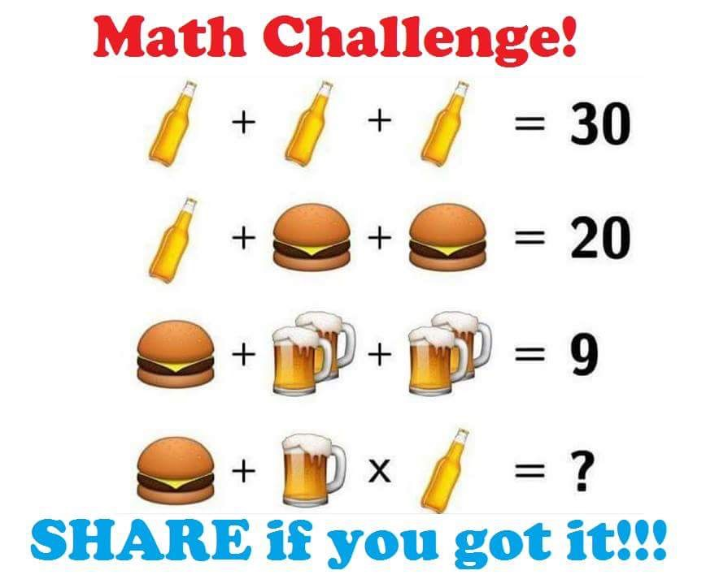
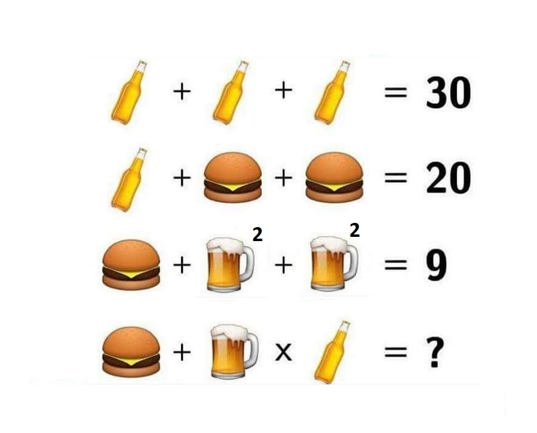

What do you usually do on Wednesdays?

Do you do something repetitive or planned before? <!-- .element: class="fragment" -->

@@@

### How to solve this?


(Left > Down) x 5 > Left > Up > Left > Down > Left > Up > Right > Up > Right > Down > Right > Up <!-- .element: class="fragment" -->

@@@

### Another example


Flowchart

@@@

### Key concepts
- A **algorithm** is an unambiguous specification of how to solve a class of problems
- A **programming language** is a formal language which comprises a set of instructions used to produce
various kinds of output.

@@@

## Python
- An interpreted high-level programming language for general-purpose programming by Guido van Rossum (1991).
- 3.7.0 / 27 June 2018
- 2.7.15 / 1 May 2018

@@@

## Python Tutorial
- Now we will sign up and start coding in [HackerRank](https://www.hackerrank.com/)
- Challenges: [https://www.hackerrank.com/domains/python](https://www.hackerrank.com/domains/python)

@@@

### Rules for writing identifiers
- Any combination of letters in lowercase (a-z) or uppercase (A-Z) or digits (0-9) or an underscore (_).
- It can not start with a digit.
- Special symbols (!@#$%&/) and whitespaces can not be used.
- Keywords can not be used as identifiers

```python
and       del       from      not       while
as        elif      global    or        with
assert    else      if        pass      yield
break     except    import    print
class     exec      in        raise
continue  finally   is        return
def       for       lambda    try
```

@@

### Naming conventions

It depends on the programming language's [programming style](https://en.wikipedia.org/wiki/Programming_style):

- lowerCamelCase
- UpperCamelCase
- lowercase_separated_by_underscores
- CAPITALIZED_WITH_UNDERSCORES

@@@

### Python Data Types:

- Boolean (True/False)
- Numbers
- String
- List
- Tuple
- Dictionary
- None

[https://docs.python.org/2/library/stdtypes.html](https://docs.python.org/2/library/stdtypes.html)
[https://docs.python.org/3/library/stdtypes.html](https://docs.python.org/3/library/stdtypes.html)

@@@

### Solve it!



@@

#### Operator precedence rule in Python

Operators |    Meaning
-- | --
() |    Parentheses
** | Exponent
*, /, //, %    | Multiplication, Division, Floor division, Modulus
+, - |    Addition, Subtraction
==, !=, >, >=, <, <=, is, is not, in, not in    | Comparisions, Identity, Membership operators
not    | Logical NOT
and    | Logical AND
or    | Logical OR

@@

### xx = x<sup>2</sup>



@@@

### Conditionals


@@

**Pseudo-code:**
```
if (boolean condition) then
	(consequent)
else
	(alternative)
end if
```

**Python:**

<div class="half-column">

if n > 0:
	print('Positive')
else:
	if n == 0:
		print('Zero')
	else:
		print('Negative')

</div>

<div class="half-column">

if n > 0:
	print('Positive')
elif n == 0:
	print('Zero')
else:
	print('Negative')

</div>

@@@

### Loops

<div class="half-column"><h4>While</h4></div>
<div class="half-column"><h4>For each</h4></div>

**Pseudo-code:**

<div class="half-column">

while (boolean condition) do
	(statements)
end while

</div>

<div class="half-column">

for each element in iterable loop
	(statements)
end for each

 </div>

**Python:**

<div class="half-column">

i = 1
while i < 5:
	print(i)
	i = i + 1

</div>

<div class="half-column">

for i in range(1, 5):
	print(i)

</div>
