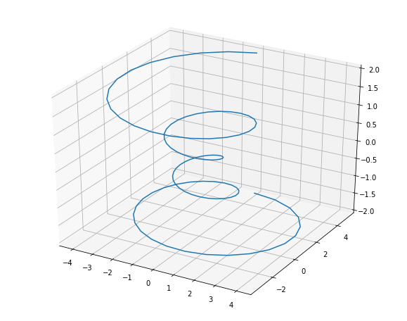

[NumPy](https://docs.scipy.org/doc/numpy/) is the fundamental package for scientific computing in Python.

<div class="fragment">
It provides **multidimensional array objects**.
</div>

@@@

### Python lists: Element-wise multiplication

```python
a = [1, 2, 3, 4, 5]
b = [5, 4, 3, 2, 1]
 
c = []
for i in range(len(a)):
    c.append(a[i]*b[i])
```

**What happens if a and b contain millions of numbers?** <!-- .element: class="fragment" -->

*Python is slow and inefficient, but it is simple and easy to use.* <!-- .element: class="fragment" -->

@@

### The same task in C


for (int i = 0; i < rows; i++) {
  c[i] = a[i]*b[i];
}


*C is fast, but is not simple* <!-- .element: class="fragment" -->

@@

### The best of both worlds: NumPy

```python
c = a * b
```

Numpy runs pre-compiled C code and is even simpler.

@@

|  | Numpy arrays | Python lists |
|:-|:-------------|:------------------------|
| Fixed size at creation | Yes | No |
| Immutable | Yes | No |
| All elements have to be of the same data type | Yes | No |
| Advanced mathematical operations | Yes | No |

@@@

### Numpy

```python
import numpy as np
```

- Mathematical and logical operations on arrays
- Discrete Fourier transforms
- Basic linear algebra
- Basic statistical operations
- Random simulation and much more

@@@

### Motivation

Linear algebra is central to almost all areas of mathematics, and is also used in most sciences and engineering areas.

@@

### Solve

$3x_0 + x_1 = 9$ and $x_0 + 2x_1 = 8$.

```python
a = np.array([[3,1],
              [1,2]])
b = np.array([9,8])
x = np.linalg.solve(a, b)
# [2., 3.]

np.matmul(a, x)
# [9., 8.]
```

@@

### Solve

$3x_0 + x_1 = 9$ and $x_0 + 2x_1 = 8$.

$A \cdot x = b$

```python
a_inv = np.linalg.inv(a)
# [[ 0.4 -0.2]
#  [-0.2  0.6]]
 
np.matmul(a_inv, a)
# [[1. 0.]
#  [0. 1.]]

np.matmul(a_inv, b)
# [2., 3.]
```

@@@

### ndarray

```python
a = np.array([1,2,3])
# [1, 2, 3]

a = np.array([[1, 2], [3, 4]]) 
# [[1, 2] 
#  [3, 4]]

a = np.array([1, 2, 3], dtype = complex) 
# [ 1.+0.j,  2.+0.j,  3.+0.j]
```

@@

### Data Types

- bool (True or False)
- complex
- int
- int8 (-128 to 127)
- int16 (-32768 to 32767)
- int32 (-2147483648 to 2147483647)
- int64 (-9223372036854775808 to 9223372036854775807)

@@

- uint8 (0 to 255)
- uint16 (0 to 65535)
- uint32 (0 to 4294967295)
- uint64 (0 to 18446744073709551615)
- float
- float16 (Half precision float)
- float32 (Single precision float)
- float64 (Double precision float)

@@@

### Shape

```python
a = np.array([[1,2,3],[4,5,6]]) 
print(a.shape) # (2, 3)
```

### Reshape
```python
a = np.arange(24)
# [ 0  1  2  3  4  5  6  7  8  9 10 11 12 13 14 15 16 17 18 19 20 21 22 23]

b = a.reshape((3,8))
# [[ 0,  1,  2,  3,  4,  5,  6,  7],
#  [ 8,  9, 10, 11, 12, 13, 14, 15],
#  [16, 17, 18, 19, 20, 21, 22, 23]])

c = a.reshape(2,4,3)
# [[[ 0,  1,  2,  3],
#  [ 4,  5,  6,  7],
#  [ 8,  9, 10, 11]],
#
#  [[12, 13, 14, 15],
#  [16, 17, 18, 19],
#  [20, 21, 22, 23]]])
```

@@@

### Other Creation Ways

```python
a = np.zeros((2,2), dtype = int)
# [[0 0]
#  [0 0]]

b = np.ones((2,2), dtype = int) 
# [[1 1]
#  [1 1]]

c = np.eye(3)
# [[1., 0., 0.],
#  [0., 1., 0.],
#  [0., 0., 1.]]

d = np.random.random((2,2))
# [[0.10333248, 0.76990895],
#  [0.77443929, 0.87454528]]

e = np.asarray([[1,2,3],[4,5,6],[7,8,9]])
# [[1, 2, 3],
#  [4, 5, 6],
#  [7, 8, 9]])
```

@@@

### Mathematical Functions

```python
np.sin(a)
np.cos(a)
np.tan(a)
np.arcsin(a)
np.degrees(a) # Radians to degrees
np.around(a, decimals)
np.floor(a)
np.ceil(a)
```

@@ 

### Basic Operations

```python
a = np.array([[1,2,3],[4,5,6],[7,8,9]]) 
b = np.array([[1,2,3],[4,5,6],[7,8,9]])

a + b
# [[ 2  4  6]
#  [ 8 10 12]
#  [14 16 18]]

a - b
# [[0 0 0]
#  [0 0 0]
#  [0 0 0]]

a * b
# [[ 1  4  9]
#  [16 25 36]
#  [49 64 81]]

a / b
# [[1 1 1]
#  [1 1 1]
#  [1 1 1]]

np.matmul(a, b)
# [[ 30  36  42]
#  [ 66  81  96]
#  [102 126 150]]

a.T
# [[1, 4, 7],
#  [2, 5, 8],
#  [3, 6, 9]]
```

@@@

### Ranges

```python
# np.arange(start, stop, step, dtype)
a = np.arange(5, dtype = float)
# [0. 1. 2. 3. 4.]

# np.linspace(start, stop, num, endpoint, dtype)
x = np.linspace(0, 20, 6)
# [ 0.  4.  8. 12. 16. 20.]
```

@@@

### Example: Data visualization

```python 
import numpy as np
from mpl_toolkits.mplot3d import Axes3D
import matplotlib.pyplot as plt
# The plots are shown in Jupyter Notebooks
%matplotlib inline

theta = np.linspace(-4 * np.pi, 4 * np.pi, 100)
z = np.linspace(-2, 2, 100)
r = z**2 + 1
x = r * np.sin(theta)
y = r * np.cos(theta)

fig = plt.figure()
ax = fig.gca(projection='3d')
ax.plot(x, y, z)
plt.show()
```

@@




@@@ 

### Indexing & Slicing

```python
a = np.arange(10) 
a[3:8:2] # Start:End:Step
# [3, 5, 7]

a = np.array([[1,2,3],[3,4,5],[4,5,6]])
a[2,1:]
# [5, 6]
```

@@

### Ellipsis (...)

```python
a = np.array([[1,2,3],[3,4,5],[4,5,6]]) 

a[...,1] 
# [2 4 5] 

a[1,...]
# [3 4 5]

a[...,1:]
# [[2 3]
#  [4 5]
#  [5 6]] 
```

@@

### Boolean Array Indexing

```python
a = np.array([[1,2,3],[4,5,6],[7,8,9]]) 

a > 5
# [[False, False, False],
#  [False, False,  True],
#  [ True,  True,  True]

a[a > 5]
# [6, 7, 8, 9]
```

@@@

### Statistical functions

#### Min

```python
a = np.arange(12).reshape(3,4)
# [[ 0  1  2  3]
#  [ 4  5  6  7]
#  [ 8  9 10 11]]

a.min()
# 0
a.min(axis=0)
# [0 1 2 3]
a.min(axis=1)
# [0 4 8]
```

@@

#### Max

```python
a = np.arange(12).reshape(3,4)
# [[ 0  1  2  3]
#  [ 4  5  6  7]
#  [ 8  9 10 11]]

a.max()
# 11
a.max(axis=0)
# [ 8  9 10 11]
a.max(axis=1)
# [ 3  7 11]
```

#### Mean

```python
a.mean()
# 5.5
a.mean(axis=0)
# [4. 5. 6. 7.]
a.mean(axis=1)
# [1.5 5.5 9.5]
```

@@

#### Standard deviation

```python
a = np.arange(12).reshape(3,4)
# [[ 0  1  2  3]
#  [ 4  5  6  7]
#  [ 8  9 10 11]]

a.std()
# 3.452052529534663
a.std(axis=0)
# [3.26598632 3.26598632 3.26598632 3.26598632]
a.std(axis=1)
# [1.11803399 1.11803399 1.11803399]
```

#### Percentile

```python
np.percentile(a, [0,25,50,75,100])
# [ 0.    2.75  5.5   8.25 11.  ]
```

@@@

### Example: Simulation

What is the expected value of the sum of two rolls of a six sided die?

```python
import numpy as np
import matplotlib.pyplot as plt
# The plots are shown in Jupyter Notebooks
%matplotlib inline

d1 = np.random.randint(1, 7, 10000)
d2 = np.random.randint(1, 7, 10000)

plt.hist(d1 + d2, bins=11, density=True)
```

@@


@@@

### Example: Data interpolation

The air temperature near the ground depends on the concentration of the carbon acid therein $H_2CO_3$. The following table shows the variation of temperature $\delta_K$ caused by a given variation of carbon acid $K$.

| Latitude | -35 | -15 | 5 | 25 | 45 | 65 |
| $\delta_{K = 0.67}$ | -3.35 | -3.12 | -3.02 | -3.17 | -3.3 | -3.1 |

Taken from: Arrhenius, S. (1896). XXXI. On the influence of carbonic acid in the air upon the temperature of the ground. The London, Edinburgh, and Dublin Philosophical Magazine and Journal of Science, 41(251), 237-276. <!-- .element: style="font-size: large;" -->

@@

```python
import numpy as np
import matplotlib.pyplot as plt
# The plots are shown in Jupyter Notebooks
%matplotlib inline

latitude = np.array([-35, -15, 5, 25, 45, 65])
delta = np.array([-3.35, -3.12, -3.02, -3.17, -3.3, -3.1])
fit = np.polyfit(latitude, delta, 5)
# [-9.11458333e-10  1.24348958e-07  1.12630208e-06 -3.87532552e-04 1.27319336e-03 -3.01689331e+00]

fit = np.poly1d(fit)
#            5             4             3             2
#-9.115e-10 x + 1.243e-07 x + 1.126e-06 x - 0.0003875 x + 0.001273 x - 3.017

latitude2 = np.array([-25, -5, 15, 35, 55])
delta2 = np.array([-3.2, -3.02, -3.07, -3.32, -3.22])

xp = np.linspace(-35, 65, 100)
fig = plt.figure(figsize=(8, 6))
plt.plot(latitude, delta, '.', xp, fit(xp), '-', latitude2, delta2, 'x')
plt.show()
```

@@


@@@

And much more in:

[https://docs.scipy.org/doc/numpy/reference/routines.html](https://docs.scipy.org/doc/numpy/reference/routines.html)